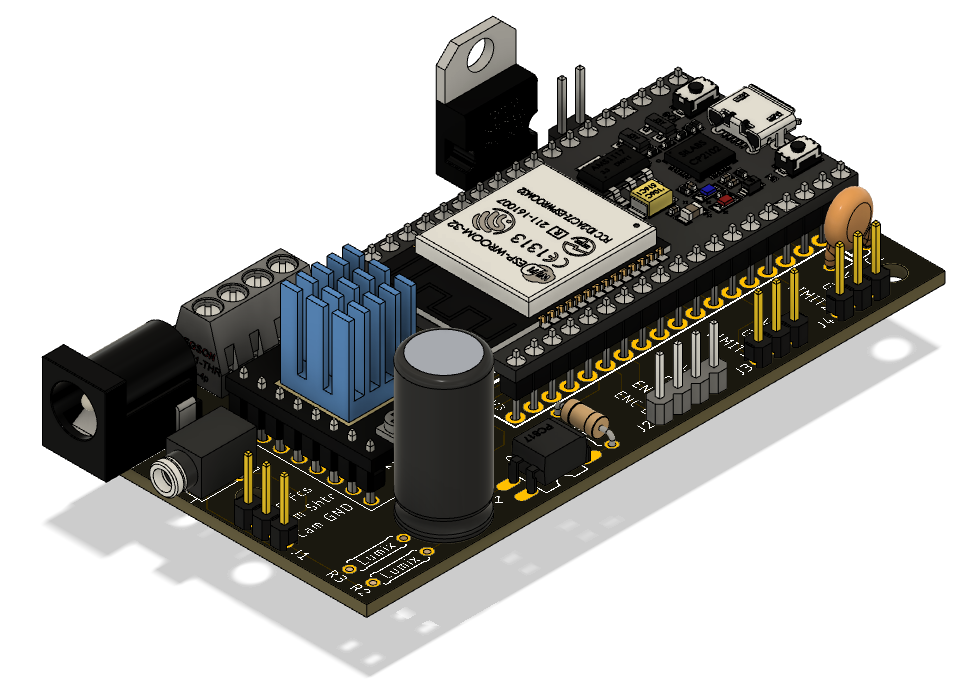
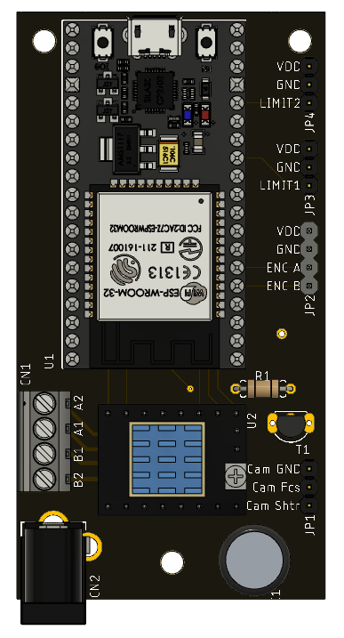
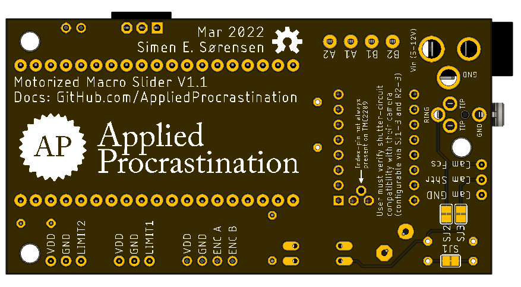

# Motorized Macro Rail Hardware

Work in Progress PCB-design for a motorized macro rail.
## Bill Of Materials
*Some of the AliExpress links are affiliate links. Prices are estimates and may vary with your location (shipping cost)*

### On PCB:
 - PCB itself. Ca $10 at JLCPCB
 - 1x [TCM2209-V1.2](https://s.click.aliexpress.com/e/_9uc1XB) Stepper motor driver ([Documentation](https://github.com/bigtreetech/BIGTREETECH-TMC2209-V1.2/)). ca $8
 - 1x [NodeMCU 32s](https://www.aliexpress.com/item/1005001636295529.html) Dev kit ([Documentation](https://docs.ai-thinker.com/en/esp32/boards/nodemcu_32s)) ca $5
 - 1x [PC817 Optocoupler](https://s.click.aliexpress.com/e/_AAgoAp) ca $1
 - 1x [470 uF capacitor](https://s.click.aliexpress.com/e/_A2G7TB) ca $1
 - 1x [2.1 mm Barrel Jack (power)](https://s.click.aliexpress.com/e/_Aq01NT) ca $1
 - 1x [Selection of resistors](https://s.click.aliexpress.com/e/_AOqGqt) (depending on your camera) ca $1
 - 1x [SJ1-2503A 2.5 mm Stereo Jack (for shutter cable)](https://no.mouser.com/ProductDetail/CUI-Devices/SJ1-2503A?qs=WyjlAZoYn52728cbIH3aBA%3D%3D) ca $1 (optional)
 - 1x [4-pin screw terminal block](https://s.click.aliexpress.com/e/_97dipR) ca $2 (optional)
 - 3x [3-pin pin row](https://s.click.aliexpress.com/e/_ABvcat) ca $1 (optional)
 - 1x [4-pin pin row](https://s.click.aliexpress.com/e/_ABvcat) ca $1 (optional)

 Total on PCB: ca $32

### Outside of PCB:
 - [Macro Rail](https://s.click.aliexpress.com/e/_9IiOvB) ca. $20 
 - [Nema 14 high torque motor](https://s.click.aliexpress.com/e/_ArX3ot) (High torque may be unnecessary for moving smaller cameras) ca $20
 - 5-12V Power supply (current can be limited with TCM2209 if 5V is too much for your motor). [Example](https://s.click.aliexpress.com/e/_AC81D7) ca $8 
 - RMS threaded microscope lens (focused to 160mm). [Example](https://s.click.aliexpress.com/e/_9zATGv) ca $8
 - Bellow spacer that fits your camera (with converters to hold the microscope lens). This is optional, and can be 3D printed instead. 
    - Examples for Canon 5D:
        - [Bellow spacer](https://s.click.aliexpress.com/e/_A5xnYt) ca $40
        - [EFS to M24 converter](https://s.click.aliexpress.com/e/_9QvErF) ca $5
        - [M42 to RMS converter](https://s.click.aliexpress.com/e/_9QPTOd) ca $5

 - Cable for shutter release that fits your camera (Current version of PCB design requires cable to be cut and soldered straight to the board. A future version will contain 3.5mm jack connector)
    - [Example for Canon 5D](https://s.click.aliexpress.com/e/_ALeXw5) ca $3
 
Total outside of PCB: ca $109 ($59 without bellow spacer and adapters)

## Preview
### Perspective
 
### Top
 
### Bottom
