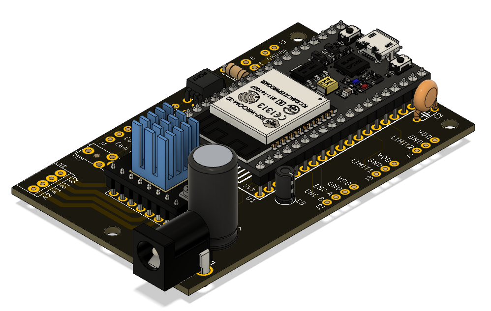

# OpenMacroRail Electronics Hardware
## Summary
PCB-design for controlling a motorized macro rail. Designed for photographers with electronics skills rather than engineers with photography skills. Main features:
- Zero surface mount components, and should therefore be possible to hand solder - even for people with novice soldering skills. 
- Flexible solution for connecting to most types of camera via 2.5mm stereo jack, pin header, or solder joints.
- Simple design for driving a single motor via a BTT TMC2209 V1.2 motor driver.
- Based on the WiFi-enabled NodeMCU 32S V2 DevKit. 
- Has broken out headers for connecting limit switches and rotary encoders (neither of which are used in the intended application the board was designed for).
- Total cost of around $30 (Camera, optics, motor, slider, and tools not included)

### Other parts of this project:
- [Firmware and web-interface](https://github.com/AppliedProcrastination/OpenMacroRail)
- [3D printable gears and PCB mount](https://www.printables.com/model/219042-motorized-camera-rail-for-macro-photography) 
- [3D printable microscope objective adapter](https://www.printables.com/model/218910-microscope-objective-adapter) (RMS Thread 160mm focal distance)
- [Canon EF/EF-S mount for the microscope adapter above](https://www.printables.com/model/218900-canon-efef-s-lens-mount-with-screw-holes)
- Section of README with links to other relevant documentation: [Various Documentation](#various-documentation)

## Configurability
The design is quite adaptable in general, and there are few components that are completely necessary for functioning (see the section "Minimum viable design"). There is however one part of the circuit that is particularly adaptable, and requires the users attention to guarantee a working configuration: the shutter control circuit - which depends on what kind of camera you are planning to control with this setup.

Snippet of schematic (DNP = Do Not Place):

As shown in the image above, there is a lot going on for what is normally a very simple circuit (you can trigger many cameras by simply short-circuiting all the pins in the remote shutter connector with a piece of wire). The reason for all this additional complexity is to keep the design as flexible as possible, and hopefully allow the PCB to be used with any type of camera. This is obviously not possible for me to test out in person, so I'm basing most of what follows on [this blog-post by Günter from LRTimelapse](https://lrtimelapse.com/news/intervalometer-hack/) (which is based on feedback from a solid photographer community) and private conversations with Stefan from [CNCKitchen](https://www.youtube.com/CNCKitchen) (as he owns a camera not mentioned in the above blog-post).

All the extra nick-nack is an attempt to solve the following design-requirements:
1. Different cameras require different signals to trigger
    - Example: 
        - Canon requires Shutter and GND to be shorted
        - Nikon/Sony requires Shutter, Focus and GND to be shorted
        - Lumix requires a [resistor network](https://i1.wp.com/fluxing.de/wp-content/uploads/2018/03/arduino-panasonic-lumix-shutter-schematic.jpg) between Shutter and GND.
2. Different cameras may swap the layout of Shutter and Focus signals on the 2.5mm jack
3. The user may not own a connector with a 2.5mm jack, so a pin header/2.54mm pitch solder joint option is also provided.
4. The high currents drawn by the motor may cause noise on the PCB, so therefore the shutter circuit is optically isolated from the rest of the electronics to avoid unintended triggering of the camera shutter.

The following components are layed out in the design solely to handle requirements 1. and 2.
- SJ1, SJ2, SJ3
- R2, R3 (Note: These are, to my knowledge, only required by Lumix - and should not be mounted by default)

The solder jumpers (SJ1-3) are there to give the user an opportunity to make permanent (but recoverable) changes to the circuit. The way this works is that each SJ consists of two exposed copper pads with a small trace connecting the pads. Cutting the trace with a scalpel will remove the connection between the pads, but it is still possible to recover this connection by applying a bit of solder as a bridge between the pads (in case the user buys a new camera, or just cut the wrong wire).

### An example of how to use solder jumpers:
Suppose your camera starts updating the screen each time the autofocus-signal is activated (even in manual focus mode), so you want to stop that signal from being activated each time a picture is captured. In this scenario, you can use a scalpel to break the wire connecting the two pads of SJ2 by cutting along the red arrow in the following picture: 

### Default configuration (Canon,Nikon,Sony):
The default configuration requires you to not mount R2 and R3. The pads on all the solder jumpers are shorted by default, meaning that a simplified schematic of the circuit looks like this:

This should work for most Canon, Nikon, and Sony cameras.

### Lumix configuration:
To use the shutter circuit with a Lumix camera, the resistor network must be mounted (R2 and R3). Keep in mind that SJ1 is shorted by default, meaning that it needs to be cut in order for R2 to take any effect.

Mount R2 and R3, then use a scalpel to break the wire in SJ1 by cutting along the red arrow in this picture.

Cutting this wire will activate R2 and leave you with the following schematic:

## Layout Options 
In the folder named Outputs/Gerber you will find design files that can be sent to a PCB manufacturer for production. There are two options, A and B, which differ only in the orientation of the power connector. 

The reason that there are two options is to accommodate for mounting the PCB on different tripod designs. Keep in mind that the PCB is mounted on a moving part of the macro rail, so protruding parts may get stuck or bent by the force from the motor.

## Bill Of Materials (BOM)
*Most of the AliExpress links are affiliate links. Prices are estimates and may vary with your location (shipping cost)*

### On PCB:
 - [PCB itself](./Outputs/Gerber/MacroRail_V1_0-2022-02-26.zip). Ca $10 at JLCPCB
 - 1x [TMC2209-V1.2](https://s.click.aliexpress.com/e/_9uc1XB) Stepper motor driver ([Documentation](https://github.com/bigtreetech/BIGTREETECH-TMC2209-V1.2/)). ca $8
 - 1x [NodeMCU 32s V2](https://www.aliexpress.com/item/1005001636295529.html) Dev kit (38-pin version) ([Documentation](https://docs.ai-thinker.com/en/esp32/boards/nodemcu_32s)) ca $5
 - 1x [PC817 Optocoupler](https://s.click.aliexpress.com/e/_AAgoAp) ca $1
 - 1x [100 uF capacitor (35V)](https://s.click.aliexpress.com/e/_ADnqKh) ca $1
 - 1x [10 uF capacitor (25V)](https://s.click.aliexpress.com/e/_ADnqKh) ca $1
 - 1x [1 uF capacitor](https://s.click.aliexpress.com/e/_9j2jOz) ca $1
 - 1x [2.1 mm Barrel Jack (power)](https://s.click.aliexpress.com/e/_Aq01NT) ca $1
 - 1x [Selection of resistors](https://s.click.aliexpress.com/e/_AOqGqt) (depending on your camera) ca $1
    - Note: R1 and R4 must always be mounted (these are 600 Ohm and 1k Ohm resistors respectively)
 - 1x [SJ1-2503A 2.5 mm stereo jack receptacle (for shutter cable)](https://no.mouser.com/ProductDetail/CUI-Devices/SJ1-2503A?qs=WyjlAZoYn52728cbIH3aBA%3D%3D) ca $1 (optional)
 - 1x [4-pin screw terminal block](https://s.click.aliexpress.com/e/_97dipR) ca $2 (optional)
 - 1x [TIP120 transistor (for powering external LED lighting)](https://s.click.aliexpress.com/e/_ApnAYv) ca $1 (optional) 
 - 3x [3-pin pin row](https://s.click.aliexpress.com/e/_ABvcat) ca $1 (optional)
 - 1x [4-pin pin row](https://s.click.aliexpress.com/e/_ABvcat) ca $1 (optional)
 - 1x [2-pin pin row](https://s.click.aliexpress.com/e/_ABvcat) ca $1 (optional)
 - 2x [19-pin pin header](https://s.click.aliexpress.com/e/_AFHrY5) ca $2 (optional)
 - 2x [8-pin pin header](https://s.click.aliexpress.com/e/_AFHrY5) ca $1 (optional)
 - 1x [2-pin pin header](https://s.click.aliexpress.com/e/_AFHrY5) ca $1 (optional)

 Total on PCB: ca $40 ($29 when excluding optional components)

### Outside of PCB:
Mandatory parts:
 - [Macro Rail](https://s.click.aliexpress.com/e/_9IiOvB) ca. $20 
 - [Nema 14 high torque motor](https://s.click.aliexpress.com/e/_ArX3ot) (High torque may be unnecessary for moving compact cameras) ca $20
 - RMS threaded microscope lens (focused to 160mm). [Example](https://s.click.aliexpress.com/e/_9zATGv) ca $8
 - 5-12V Power supply (current can be limited with TMC2209 if 5V is too much for your motor). [Example](https://s.click.aliexpress.com/e/_AC81D7) ca $8 
 - Cable for shutter release that fits your camera (you can either use the 2.5mm jack receptacle or cut the cable and solder it directly to the PCB via JP1)
    - [Example for various cameras](https://s.click.aliexpress.com/e/_9iNl7J) ca $3

Parts that can be 3D-printed if you design something that suits your camera:
 - Bellow spacer that fits your camera (with converters to hold the microscope lens). This is optional, and can be 3D printed instead. 
    - Examples for Canon 5D:
        - [Bellow spacer](https://s.click.aliexpress.com/e/_A5xnYt) ca $40
        - [EFS to M24 converter](https://s.click.aliexpress.com/e/_9QvErF) ca $5
        - [M42 to RMS converter](https://s.click.aliexpress.com/e/_9QPTOd) ca $5
 
Total outside of PCB: ca $109 ($59 when excluding parts that can be 3D-printed)

## Preview

### Top

### Bottom

### Minimum viable design
Note: You may need to mount more resistors to get a minimum viable design (depending on your camera)

## How to order a printed circuit board (PCB)?
If you are interested in this project, and feel comfortable soldering electronic components, but have never ordered a custom PCB before this section is for you. 

Hobby-grade PCB manufacturers have made the process of ordering custom PCBs incredibly simple (and cheap) over the last few years, so for a low complexity board like this one, ordering can be done without any prior knowledge of the manufacturing process. 

### Step by step guide:

1. Decide whether you want your power connector oriented sideways (Option A) or downwards (Option B). Try to think about whether the power cable may get in the way of movement the tripod you plan to mount your macro rail to. See the section about [Layout Options](#layout-options) for more info.
2. Download the .zip file corresponding to your preferred layout option from the folder [/Outputs/Gerber](/Outputs/Gerber/). This is the design file that you will send to the manufacturer for fabrication.
3. Go to your preferred PCB manufacturers website and upload the gerber file. This board was designed for using https://www.jlcpcb.com, which is a very cheap, and fast, hobby-grade manufacturer. 

4. Once the upload is complete, you will see a preview of the board, and the web-tool will have learned most of the important parameters of the design (like the size, how many layers of copper it contains, etc.)

5. There's only one important thing you may need to fill in, which is the order of the layers. For some reason, the web-tool doesn't recognize the _l1, _l2, _l3, and _l4, suffixes of each layer, so you need to select these layers as shown in the image below. 

While you are at it, make sure to select the sexy black soldermask, and click "specify a location" for the order number. The last setting will ensure that the manufacturer doesn't place an order number anywhere important, but rather replace a predefined string like shown here:

6. That's it! Click "Save to cart", pay, and the board will be manufactured and shipped towards you within a two or three days (typically). Note that there is a cheap shipping option kind of hidden in the menu. If you didn't already have all the other necessary components in your electronics stockpile, it might be a good idea to consider this "slow" shipping option since you are already waiting for other stuff. In my experience, the PCBs arrive between 2 and 3 weeks after placing your order (when using the cheapest shipping option).

## Various documentation:
- [NodeMCU-32S Core Development Board](https://docs.ai-thinker.com/en/esp32/boards/nodemcu_32s)
- [NodeMCU Arduino Core (Software)](https://github.com/espressif/arduino-esp32)
- [TMC2209-V1.2 manual (Motor driver module)](https://github.com/bigtreetech/BIGTREETECH-TMC2209-V1.2/blob/master/manual/TMC2209-V1.2-manual.pdf)
- [TMC2209 datasheet (chip itself)](https://www.trinamic.com/fileadmin/assets/Products/ICs_Documents/TMC2209_datasheet_rev1.07.pdf)